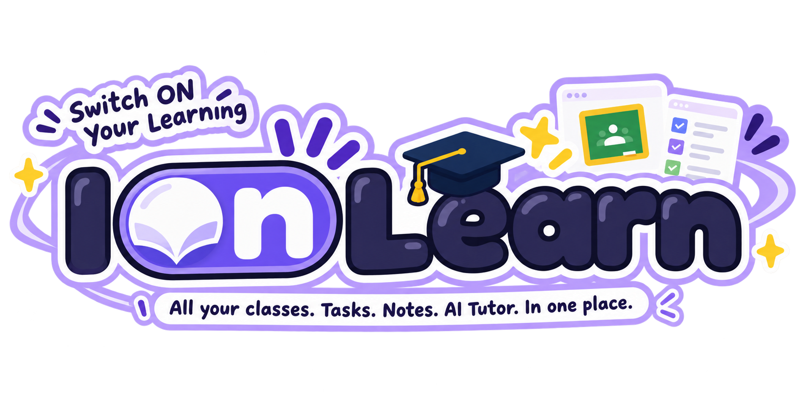
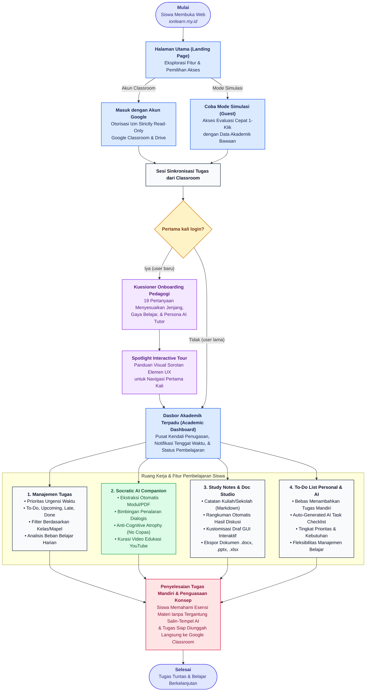

<p align="center">
  
</p>

<p align="center">
  <strong>Free and Open-Source Academic Productivity Suite & Socratic AI Study Companion Connected to Google Classroom</strong>
</p>

<p align="center">
  <a href="https://www.gnu.org/licenses/gpl-3.0.html"></a>
  <a href="https://nextjs.org"></a>
  <a href="https://www.typescriptlang.org"></a>
  <a href="https://tailwindcss.com"></a>
  <a href="https://firebase.google.com"></a>
  <a href="https://www.cloudflare.com"></a>
  <a href="https://vercel.com"></a>
</p>

<p align="center">
  <a href="https://ai.google.dev"></a>
  <a href="https://openai.com"></a>
  <a href="https://ollama.com"></a>
  <a href="https://developers.google.com/classroom"></a>
</p>

---

## Overview

IOnLearn ("Switch ON Your Learning") is a free, copyleft open-source academic productivity platform and conversational AI study tutor designed for students, self-learners, and educators. It unifies scattered coursework, class announcements, deadlines, and study materials into a single focused dashboard.

By integrating directly with Google Classroom through strictly read-only scopes, IOnLearn categorizes upcoming assignments by urgency, parses syllabus attachments, and pairs students with a Socratic AI study companion. Rather than generating direct answers that bypass critical thinking, the AI tutor scaffolds learning step-by-step to build conceptual mastery.

IOnLearn is completely open-source under the **GNU General Public License v3 (GPLv3)**. It is model-agnostic, supporting both cloud APIs (Google Gemini) and local or custom-routed LLMs ([Ollama](https://github.com/ollama/ollama), [LM Studio](https://lmstudio.ai/), [9router](https://github.com/decolua/9router), [OmniRoute](https://github.com/diegosouzapw/OmniRoute), [vLLM](https://github.com/vllm-project/vllm)).

---

## 🎯 Alignment with Competition Theme and SDGs (Infinitera 2.0)

> **Event**: INFINITERA 2.0 — Web Development Competition  
> **Host**: Himpunan Mahasiswa Teknik Informatika (HM TIF), Universitas Islam Sultan Agung (UNISSULA)  
> **Grand Theme**: *“Bridging Innovation and Sustainability to Create Meaningful Impact for Future Generations”*

IOnLearn was purposefully engineered to embody this theme by bridging cutting-edge technological innovation (Socratic conversational AI, edge intelligence, model-agnostic architecture) with sustainable societal impact for current and future generations.

```
                  ┌────────────────────────────────────────────────────────┐
                  │                    INFINITERA 2.0                      │
                  │   Bridging Innovation & Sustainability for Impact      │
                  └──────────────────────────┬─────────────────────────────┘
                                             │
                       ┌─────────────────────┴─────────────────────┐
                       ▼                                           ▼
                  🎓 SDG 4                                    💡 SDG 9
              Quality Education                          Industry, Innovation
          (Pendidikan Berkualitas)                    & Infrastructure (Inovasi)
```

### Alignment with United Nations Sustainable Development Goals (UN SDGs)

| UN SDG Pillar | Official UN Target & Sub-Mandate | IOnLearn Implementation & Impact |
| :--- | :--- | :--- |
| **[SDG 4: Quality Education](https://sdgs.un.org/goals/goal4)** | **Target 4.4:** Substantially increase the number of youth and adults who have relevant skills for employment, decent jobs, and entrepreneurship.<br><br>**Target 4.c:** Expand equitable learning opportunities and qualified study support for all learners. | • **Democratizing 1-on-1 Academic Tutoring**: High-quality private tutoring is made 100% free and open-source (GPLv3), granting every student a 24/7 personal academic study companion regardless of socioeconomic background.<br>• **Socratic Pedagogy (Anti-Cognitive Atrophy)**: Instead of spoon-feeding direct answers like generic commercial LLMs, IOnLearn guides students step-by-step using Socratic inquiry grounded in official course materials, fostering genuine critical thinking and conceptual mastery.<br>• **Inclusive & Adaptive Learning**: Offers automatic bilingual detection (Indonesian & English), customizable learning styles (Visual, Step-by-Step, In-Depth), and full accessibility compliance (screen-reader friendly, responsive keyboard navigation, dark/light modes). |
| **[SDG 9: Industry, Innovation, & Infrastructure](https://sdgs.un.org/goals/goal9)** | **Target 9.5:** Enhance scientific research, upgrade technological capabilities, and encourage innovation.<br><br>**Target 9.c:** Significantly increase access to information and communications technology (ICT) and provide universal, affordable access. | • **Model-Agnostic & Decentralized Edge AI**: Breaks proprietary vendor lock-in by supporting local, offline LLMs ([Ollama](https://github.com/ollama/ollama), [LM Studio](https://lmstudio.ai/), [vLLM](https://github.com/vllm-project/vllm)) on consumer hardware, enabling students in low-connectivity areas to access AI assistance without relying on costly cloud APIs.<br>• **Client-Side Document Synthesis & Green Computing**: Innovates in-browser compilation of Microsoft Office documents (.docx, .pptx, .xlsx) without external conversion servers, conserving energy and guaranteeing total data sovereignty.<br>• **Resilient Multi-Tier Cloud Infrastructure**: Deployed across Cloudflare Anycast Edge CDN and Vercel Serverless Platform, ensuring high availability, DDoS protection, and low latency.<br>• **Open-Source Innovation (GNU GPLv3)**: Guarantees full code transparency, community auditability, and continuous development without reliance on closed commercial infrastructure. |

---

## Live Demo & Juror Testing Access

- **Public Production Deployment**: [https://ionlearn.my.id](https://ionlearn.my.id)
- **Dedicated Juror Evaluation Account (Live Google Classroom)**:
  - **Email**: `violettaionlearn@gmail.com`
  - **Password**: `violetta123#`
  - *Evaluators can log in using this account to inspect full live Google Classroom synchronization, course attachments, coursework deadlines, and active Socratic AI tutoring.*
- **Instant Demo Mode (Guest Evaluation)**:
  - To evaluate the platform instantly without signing into a Google account, simply click **"Coba Mode Demo" (Try Demo Mode)** on the landing page.
  - This immediately initializes a simulated student profile pre-loaded with realistic courses, upcoming deadline tasks, syllabus attachments, and study notes ready for testing with the AI Tutor.

---

## Key Features

- **Google Classroom Integration**: One-click synchronization for enrolled courses, assignments (`courseWork`), instructions, due dates, classroom materials, and submission statuses (`turned in`, `assigned`, `late`).
- **Socratic AI Study Companion**:
  - **Step-by-Step Guided Reasoning**: Helps students dissect complex problems, understand core principles, and arrive at answers independently.
  - **Automated Multi-Format Attachment Ingestion**: Automatically extracts and links attached coursework materials (PDFs via workerless `unpdf`, Word `.docx`, PowerPoint `.pptx`, Excel `.xlsx`, and Google Workspace files) directly from Google Classroom so tutoring is grounded in official syllabus documents.
  - **Adaptive Study Modes**: Automatically generates topic summaries, review flashcards, practice quizzes, and simplified conceptual breakdowns.
- **Comprehensive Academic Personalization Onboarding**: Interactive 19-step pedagogical questionnaire for first-time learners that calibrates education level, field of study, learning style, note preferences, and Socratic AI tutor persona.
- **Adaptive Language & Geolocation Engine**: Automatically detects user timezone and browser locale to default to Indonesian or English, with instant manual toggle in Settings.
- **Task & Deadline Management**: Automated sorting into actionable categories: To-Do, Upcoming, Late, and Completed.
- **Study Notes Workspace**: Markdown-enabled notebook for archiving lecture summaries, AI conversations, and personal study insights grouped by course.
- **AI Document Studio (.docx, .pptx, .xlsx)**: Convert AI explanations, study notes, and tabular data into formatted Word documents, PowerPoint presentations, and Excel spreadsheets with a visual GUI customizer.
- **Instant Guest / Demo Evaluation Mode**: Test drive the full platform without Google OAuth using pre-seeded academic data.
- **Modern Responsive Interface**: Clean, distraction-free UI with full Dark Mode and Light Mode support, installable as a Progressive Web App (PWA) across desktop, tablet, and mobile.
- **Strict Read-Only Privacy**: Only requests read-only permissions from Google Classroom and Google Drive. The application never modifies, creates, or deletes user files or submissions.

---

## AI Document Studio and GUI Customizer (.docx, .pptx, .xlsx)

IOnLearn includes a built-in document authoring studio that compiles native Microsoft Office files entirely client-side without sending content to third-party conversion servers. Students can transform AI tutoring chats and lecture summaries into formal academic deliverables through an interactive modal customizer:

### 1. Microsoft Word (.docx) — Academic Paper Generator
- **Formal Academic Letterhead (Kop Surat)**: Add official school/university headers, custom institutional logos, institution addresses, and divider borders.
- **Author Identity & Metadata**: Pre-fill student name, student ID (NIM/NISN), course subject, supervisor/teacher name, and class section.
- **Strict Academic Formatting**:
  - Standard thesis margins: **4 cm left, 3 cm top, right, and bottom** (configurable to normal or compact).
  - Standard academic typography: Times New Roman, Calibri, Arial, Georgia, or Garamond.
  - Line spacing options: 1.15, 1.5, or 2.0 with full text justification.
- **Markdown & Math Compilation**: Seamlessly translates headings, bullet points, callout boxes, and tabular data into native Word XML elements.

### 2. Microsoft PowerPoint (.pptx) — Visual Presentation Builder
- **Automatic Slide Deck Generation**: Converts AI study breakdowns and coursework summaries into multi-slide presentation decks via `pptxgenjs`.
- **Presentation Aspect Ratios**: Choose between modern **16:9 Widescreen** or classic **4:3 Projector** layouts.
- **Curated Slide Themes**: Royal Indigo, Cobalt Blue, Emerald, Modern Dark, and Warm Amber palettes.
- **Structured Content Layouts**: Title slides, bullet-point cards, comparison blocks, and concluding Q&A slides with consistent typography.

### 3. Microsoft Excel (.xlsx) — Tabular Data Workbook Generator
- **Structured Data Export**: Automatically converts tables, project budgets, experimental lab readings, and grade trackers into spreadsheets via `xlsx`.
- **Professional Table Styling**: Color-coded header rows, zebra-striped records, custom borders, and auto-fitted column widths.
- **Multiple Theme Presets**: Emerald Excel, Modern Teal, Royal Indigo, and Graphite Slate.

### 4. In-Browser Interactive GUI Customizer
- **Real-Time Visual Preview**: Inspect document layout, typography, and theme styling before downloading.
- **Logo Drag-and-Drop Uploader**: Embed your university or school emblem directly into generated headers and title slides.
- **Zero-Latency Client-Side Build**: Generates `.docx`, `.pptx`, and `.xlsx` binaries in-memory inside the browser with zero cloud conversion delay and 100% data privacy.

---

## System Architecture

```mermaid
flowchart TD

subgraph group_experience["Student Experience"]
  node_landing["Landing Experience<br/>[LandingPage.tsx]"]
  node_dashboard["Academic Dashboard<br/>[page.tsx]"]
  node_task_views["Task Views<br/>[TaskCard.tsx]"]
end

subgraph group_academic["Academic Workspace"]
  node_classroom_service["Classroom Service"]
  node_sync_manager["Sync Manager<br/>[syncManager.ts]"]
  node_task_store["Tasks Notes Todos<br/>[taskStore.ts]"]
  node_db_service["Cloud Data Service<br/>[dbService.ts]"]
  node_browser_storage[("Browser Storage")]
end

subgraph group_ai["AI Learning"]
  node_ai_chat_route["AI Chat Route<br/>[route.ts]"]
  node_task_analysis["Task Analysis<br/>[route.ts]"]
  node_ai_tools["Study Tools<br/>[route.ts]"]
  node_file_parser["File Parser<br/>[route.ts]"]
  node_drive_reader["Drive Reader<br/>[route.ts]"]
end

subgraph group_integrations["External Integrations"]
  node_google_classroom["Google Classroom"]
  node_google_drive["Google Drive"]
  node_youtube["YouTube"]
  node_gemini["Gemini API"]
  node_openai_local["OpenAI or Local LLM"]
  node_firebase[("Firebase Firestore")]
end

node_student(("Student"))

node_student -->|"opens app"| node_landing
node_student -->|"signs in"| node_classroom_service
node_classroom_service -->|"fetches coursework"| node_google_classroom
node_sync_manager -->|"runs sync"| node_classroom_service
node_sync_manager -->|"loads cloud data"| node_db_service
node_sync_manager -->|"persists tasks"| node_task_store
node_task_store -->|"reads writes"| node_browser_storage
node_db_service -->|"stores user data"| node_firebase
node_student -->|"reviews learning"| node_dashboard
node_dashboard -->|"subscribes state"| node_sync_manager
node_dashboard -->|"renders tasks"| node_task_views
node_task_views -->|"updates progress"| node_task_store
node_task_analysis -->|"generates analysis"| node_gemini
node_task_analysis -.->|"optionally routes"| node_openai_local
node_ai_tools -->|"generates study tools"| node_gemini
node_ai_tools -.->|"optionally routes"| node_openai_local
node_ai_chat_route -->|"generates tutoring"| node_gemini
node_ai_chat_route -.->|"optionally routes"| node_openai_local
node_file_parser -->|"provides file text"| node_ai_chat_route
node_drive_reader -->|"reads materials"| node_google_drive
node_ai_chat_route -->|"requests grounding"| node_drive_reader
node_ai_chat_route -->|"uses video context"| node_youtube

click node_landing "https://github.com/bluebleaze/ionlearn/blob/main/src/components/LandingPage.tsx"
click node_dashboard "https://github.com/bluebleaze/ionlearn/blob/main/src/app/dashboard/page.tsx"
click node_task_views "https://github.com/bluebleaze/ionlearn/blob/main/src/components/TaskCard.tsx"
click node_classroom_service "https://github.com/bluebleaze/ionlearn/blob/main/src/services/classroomService.ts"
click node_sync_manager "https://github.com/bluebleaze/ionlearn/blob/main/src/services/syncManager.ts"
click node_task_store "https://github.com/bluebleaze/ionlearn/blob/main/src/lib/taskStore.ts"
click node_db_service "https://github.com/bluebleaze/ionlearn/blob/main/src/services/dbService.ts"
click node_ai_chat_route "https://github.com/bluebleaze/ionlearn/blob/main/src/app/api/ai/chat/route.ts"
click node_task_analysis "https://github.com/bluebleaze/ionlearn/blob/main/src/app/api/ai/analyze-task/route.ts"
click node_ai_tools "https://github.com/bluebleaze/ionlearn/blob/main/src/app/api/ai/tools/route.ts"
click node_file_parser "https://github.com/bluebleaze/ionlearn/blob/main/src/app/api/ai/parse-file/route.ts"
click node_drive_reader "https://github.com/bluebleaze/ionlearn/blob/main/src/app/api/drive/read/route.ts"

classDef toneNeutral fill:#f8fafc,stroke:#334155,stroke-width:1.5px,color:#0f172a
classDef toneBlue fill:#dbeafe,stroke:#2563eb,stroke-width:1.5px,color:#172554
classDef toneAmber fill:#fef3c7,stroke:#d97706,stroke-width:1.5px,color:#78350f
classDef toneMint fill:#dcfce7,stroke:#16a34a,stroke-width:1.5px,color:#14532d
classDef toneRose fill:#ffe4e6,stroke:#e11d48,stroke-width:1.5px,color:#881337
classDef toneIndigo fill:#e0e7ff,stroke:#4f46e5,stroke-width:1.5px,color:#312e81
classDef toneTeal fill:#ccfbf1,stroke:#0f766e,stroke-width:1.5px,color:#134e4a
class node_landing,node_dashboard,node_task_views toneBlue
class node_classroom_service,node_sync_manager,node_task_store,node_db_service,node_browser_storage toneAmber
class node_ai_chat_route,node_task_analysis,node_ai_tools,node_file_parser,node_drive_reader toneMint
class node_google_classroom,node_google_drive,node_youtube,node_gemini,node_openai_local,node_firebase toneRose
class node_student toneIndigo
```



---

## User Flow



---

## AI Architecture: Cloud and Local Inference

IOnLearn decouples application logic from specific model providers. You can choose between managed cloud endpoints or completely private, offline execution via any OpenAI-compatible API gateway.

### 1. Default: Google Gemini API
Native integration using the official `@google/genai` SDK with support for `gemini-3.6-flash`, `gemini-3.5-flash`, `gemini-3.1-flash-lite`, and newer Gemini models.

### 2. Local AI and OpenAI-Compatible Routers
Connect IOnLearn to local inference servers or multi-model gateways by pointing to an OpenAI-compatible endpoint:
- **[Ollama](https://github.com/ollama/ollama)** (`http://localhost:11434/v1`): Run open-weight models (Llama 3, DeepSeek-R1, Qwen 2.5, Mistral, Gemma 2) locally on your own hardware without internet access.
- **[LM Studio](https://lmstudio.ai/)** (`http://localhost:1234/v1`): Run local GGUF models with a desktop interface.
- **AI Gateways & Routers**:
  - [9router](https://github.com/decolua/9router) / [OmniRoute (omnirouter)](https://github.com/diegosouzapw/OmniRoute)
  - [OpenRouter](https://openrouter.ai/) (`https://openrouter.ai/api/v1`)
  - [vLLM](https://github.com/vllm-project/vllm), [LocalAI](https://github.com/mudler/LocalAI), [Jan](https://github.com/janhq/jan), or [Text Generation WebUI](https://github.com/oobabooga/text-generation-webui).

#### Environment Configuration for AI (`.env`):
```env
# Choose active provider: 'gemini' or 'openai'
AI_PROVIDER="openai"

# OpenAI-Compatible / Local Router Configuration
OPENAI_BASE_URL="http://localhost:11434/v1"      # Example: Local Ollama, or your 9router / omnirouter address
OPENAI_API_KEY="ollama"                         # Arbitrary string for local instances, or router API key
OPENAI_MODEL="qwen2.5:7b"                       # Model tag available in your local runner
```

---

## Tech Stack

- **Framework**: Next.js 16+ (App Router), React 19, TypeScript
- **Styling & UI**: Tailwind CSS, Lucide React, Radix UI, Sonner (Toasts)
- **Backend & APIs**: Next.js Server Route Handlers, `@google/genai`, standard Fetch API
- **Document & Material Parsing**: `unpdf` (workerless server/edge PDF parser), `jszip` (`.docx` & `.pptx`), `xlsx` (spreadsheets), `docx`, `pptxgenjs`
- **Authentication & Database**: Firebase Authentication (Google OAuth 2.0) and Cloud Firestore
- **External APIs**: Google Classroom API (v1), Google Drive API (v3)

---

## Getting Started

### Prerequisites
- Node.js 18.18+ or 20+
- A Google Cloud project with Google Classroom API, Google Drive API, and Firebase enabled
- A Google AI Studio API key (for Gemini) or a running local LLM instance (Ollama, LM Studio)

### 1. Clone the Repository
```bash
git clone https://github.com/bluebleaze/IOnLearn.git
cd IOnLearn
```

### 2. Install Dependencies
```bash
npm install
```

### 3. Configure Environment Variables
Copy `.env.example` to `.env`:

```bash
cp .env.example .env
```

Configure the environment variables:
```env
# --- 1. AI CONFIGURATION ---
GEMINI_API_KEY="AIzaSy..."                      # API Key from Google AI Studio
NEXT_PUBLIC_GEMINI_MODEL="gemini-3.6-flash"     # Default / recommended model (or gemini-3.1-flash-lite)
AI_PROVIDER="gemini"                            # 'gemini' or 'openai'

# (Optional) If using Local AI / Ollama / 9router / omnirouter:
# AI_PROVIDER="openai"
# OPENAI_BASE_URL="http://localhost:11434/v1"
# OPENAI_API_KEY="ollama"
# OPENAI_MODEL="llama3.1:8b"

# --- 2. BRANDING ---
NEXT_PUBLIC_APP_NAME="IOnLearn"
NEXT_PUBLIC_APP_TAGLINE="Academic Productivity & AI Study Companion"

# --- 3. FIREBASE & GOOGLE AUTH ---
NEXT_PUBLIC_FIREBASE_PROJECT_ID="your-firebase-project-id"
NEXT_PUBLIC_FIREBASE_APP_ID="1:xxxx:web:xxxx"
NEXT_PUBLIC_FIREBASE_API_KEY="AIzaSy..."
NEXT_PUBLIC_FIREBASE_AUTH_DOMAIN="your-project.firebaseapp.com"
NEXT_PUBLIC_FIREBASE_STORAGE_BUCKET="your-project.firebasestorage.app"
NEXT_PUBLIC_FIREBASE_MESSAGING_SENDER_ID="xxxx"
NEXT_PUBLIC_FIREBASE_OAUTH_CLIENT_ID="xxxx.apps.googleusercontent.com"
```

### 4. Firebase and Google Cloud Console Setup

1. **Firebase Authentication**:
   - In Firebase Console, go to **Authentication** -> **Sign-in method**.
   - Enable the **Google** provider.
2. **Google Cloud Console (Enabling Required APIs)**:
   - Go to [Google Cloud Console](https://console.cloud.google.com/) and select your project.
   - Under **APIs & Services** -> **Library**, search and **ENABLE** the following two APIs:
     1. **Google Classroom API**: Required to synchronize courses, coursework, assignments, and due dates.
     2. **Google Drive API** *(Mandatory)*: Required for the AI to automatically read and parse course attachments (PDF, Word `.docx`, PowerPoint `.pptx`, Excel `.xlsx`, and Google Docs/Sheets) in the background without forcing students to manually download and upload files.
        > 💡 **Quick Activation Link**: `https://console.developers.google.com/apis/api/drive.googleapis.com/overview?project=YOUR_PROJECT_NUMBER`
   - Under **OAuth consent screen** -> **Scopes**, ensure the following read-only scopes are added:
     - `https://www.googleapis.com/auth/classroom.courses.readonly`
     - `https://www.googleapis.com/auth/classroom.coursework.me.readonly`
     - `https://www.googleapis.com/auth/classroom.student-submissions.me.readonly`
     - `https://www.googleapis.com/auth/classroom.courseworkmaterials.readonly`
     - `https://www.googleapis.com/auth/drive.readonly` (required to read coursework file attachments)
     - `https://www.googleapis.com/auth/userinfo.email`
     - `https://www.googleapis.com/auth/userinfo.profile`
3. **Cloud Firestore Security Rules**:
   Apply these rules to restrict database access to authenticated resource owners:
   ```javascript
   rules_version = '2';
   service cloud.firestore {
     match /databases/{database}/documents {
       match /users/{userId}/{document=**} {
         allow read, write: if request.auth != null && request.auth.uid == userId;
       }
     }
   }
   ```

### 5. Running the Application
```bash
# Development mode
npm run dev

# Production build and start
npm run build
npm run start
```
Open [http://localhost:3000](http://localhost:3000) in your browser.

---

## Data Privacy and Compliance

IOnLearn adheres to strict student data protection guidelines:
- **Read-Only Operation**: The application requests only read-only scopes for Google Classroom and Drive data. It cannot alter grades, delete files, or modify student submissions.
- **No Data Commercialization**: User data is never sold, shared, or brokered to advertising networks or third parties.
- **Limited Use Compliance**: Fully compliant with the [Google API Services User Data Policy](https://developers.google.com/terms/api-services-user-data-policy), including all Limited Use requirements.
- **No Model Training on User Data**: Classroom and Drive data ingested during tutoring sessions is never used to train or fine-tune public foundation models.

---

## Contributing

Contributions from the open-source community are welcome and **greatly appreciated**. To contribute:

1. Fork this repository.
2. Create a feature branch (`git checkout -b feature/new-capability`).
3. Commit your changes (`git commit -m 'feat: add custom router support'`).
4. Push your branch (`git push origin feature/new-capability`).
5. Open a Pull Request.

All contributions to this project must be released under the terms of the GNU General Public License v3.

---

## Contributors

Thank you to everyone who has contributed to the development and improvement of IOnLearn.

<p align="center">
  <a href="https://github.com/bluebleaze/IOnLearn/graphs/contributors">
    
  </a>
</p>

### Top Contributors

- **[@inihelta](https://github.com/inihelta)** - Frontend Developer & Project Designer Lead
- **[@bluebleaze](https://github.com/bluebleaze)** - Backend Developer & DevOps Engineer
- **[@moonelliaven](https://github.com/moonelliaven)** - UI/UX Designer & Project Quality Assurance

---

## Open Source License: GNU GPLv3

IOnLearn is free software licensed under the **GNU General Public License v3.0 (GPLv3)**.

### What GPLv3 Means for You

The GNU General Public License is a strong copyleft license designed to guarantee that the software remains free and open for all users, protecting community rights against proprietary lock-in.

- **Freedom to Run**: You have the unrestricted freedom to run this program for any purpose—educational, personal, research, or commercial.
- **Freedom to Study and Inspect**: You have full access to the complete source code to inspect how it works, how your data is handled, and how AI prompts are constructed.
- **Freedom to Modify**: You can adapt, customize, and extend IOnLearn to fit your school, university, or personal workflow.
- **Freedom to Share and Redistribute**: You may distribute verbatim copies or modified versions of this software, provided that any distributed derivative work is also licensed under the **GPLv3** with its corresponding source code made publicly available.
- **Anti-Tivoization**: Hardware manufacturers or cloud hosts cannot lock this software to prevent users from installing modified versions.
- **Patent Grant**: Contributors provide an explicit grant of patent rights, protecting downstream developers and users from patent litigation.

```
Copyright (C) 2026 IOnLearn Contributors

This program is free software: you can redistribute it and/or modify
it under the terms of the GNU General Public License as published by
the Free Software Foundation, either version 3 of the License, or
(at your option) any later version.

This program is distributed in the hope that it will be useful,
but WITHOUT ANY WARRANTY; without even the implied warranty of
MERCHANTABILITY or FITNESS FOR A PARTICULAR PURPOSE. See the
GNU General Public License for more details.
```

For the complete legal text, please refer to the [LICENSE](LICENSE) file.